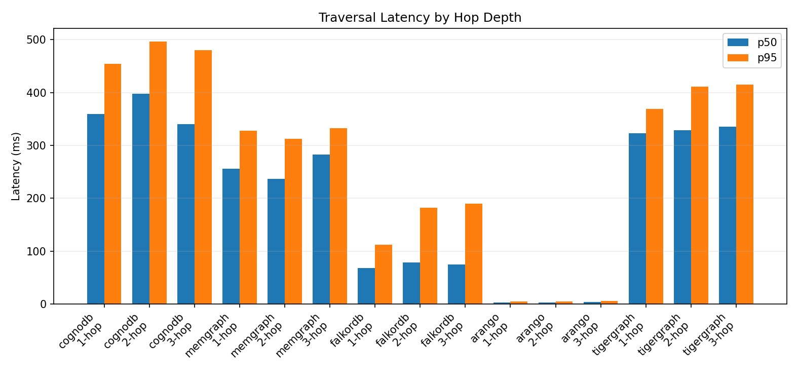
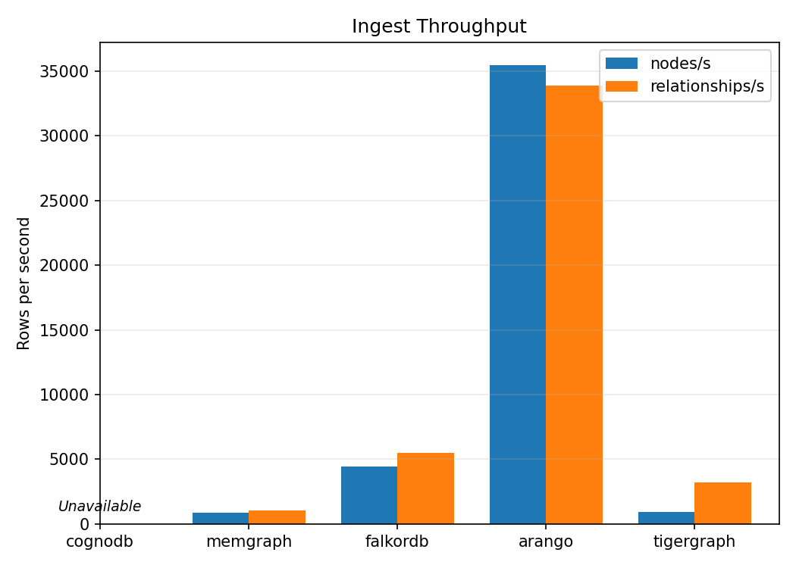
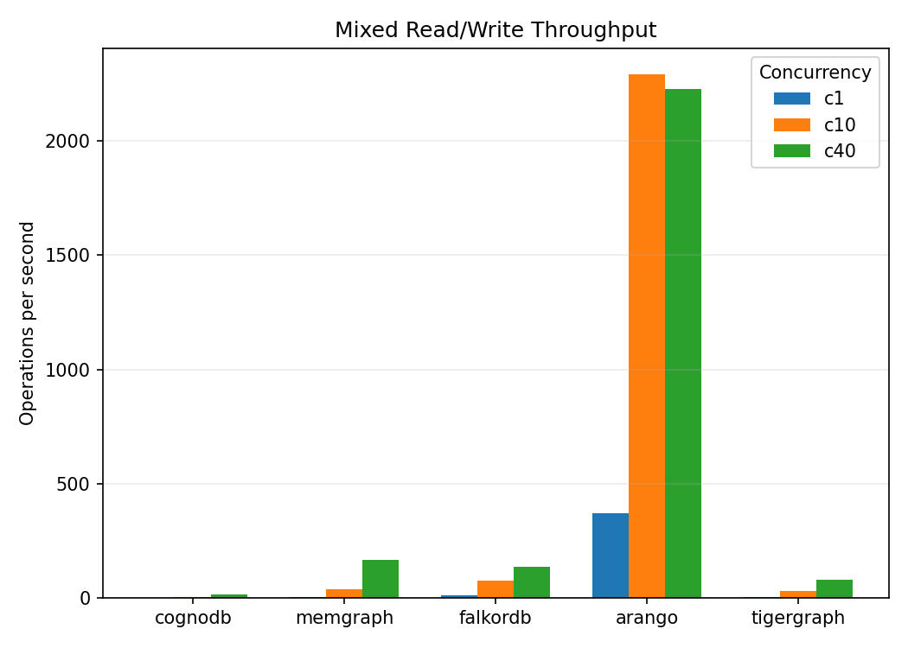

# Graph DB Benchmark

## Overview

A reproducible, reduced graph-database benchmark of CognoDB Cloud and four comparison platforms using one shared deterministic SNAP soc-Pokec sample.

For full setup and reproducibility instructions, see [HOW_TO_RUN.md](HOW_TO_RUN.md).

## Databases Selected

The final comparison covers CognoDB, Memgraph, FalkorDB, ArangoDB, and TigerGraph. CognoDB is the target platform; the comparison set spans Bolt/Cypher-compatible systems (Memgraph), a Redis-graph implementation (FalkorDB), a multi-model database queried with AQL (ArangoDB), and a schema-first GSQL/REST++ graph system (TigerGraph). This is a technical coverage rationale, not a claim that the managed deployments have equivalent hardware, tier, or region.

## Results

## Benchmark Summary

| Database | Ingest nodes/s | Ingest rels/s | 1-hop p95 ms | Indexed lookup p50 ms | Aggregation p95 ms | Mixed c1 QPS | Mixed c10 QPS | Mixed c40 QPS |
| --- | --- | --- | --- | --- | --- | --- | --- | --- |
| cognodb | Unavailable | Unavailable | 454.32 | 355.78 | 413.48 | 0.49 | 4.70 | 16.67 |
| memgraph | 864.41 | 1045.43 | 327.69 | 289.35 | 319.87 | 3.98 | 38.44 | 166.43 |
| falkordb | 4435.53 | 5515.57 | 111.62 | 63.97 | 182.23 | 10.42 | 73.99 | 135.52 |
| arango | 35438.75 | 33893.23 | 4.24 | 1.16 | 3.13 | 370.10 | 2291.46 | 2227.62 |
| tigergraph | 951.96 | 3192.28 | 368.89 | 352.90 | 411.81 | 2.93 | 28.99 | 78.00 |

CognoDB fresh-ingestion throughput is **Unavailable**: its isolated namespace could not be safely reset after a relationship-delete/commit inconsistency. Missing ingestion values are not treated as zero.

### Traversal Latency

| metric | cognodb | memgraph | falkordb | arango | tigergraph |
| --- | --- | --- | --- | --- | --- |
| 1-hop p50 ms | 359.15 | 256.24 | 67.96 | 2.81 | 322.58 |
| 1-hop p95 ms | 454.32 | 327.69 | 111.62 | 4.24 | 368.89 |
| 2-hop p50 ms | 398.15 | 236.20 | 78.47 | 3.05 | 328.39 |
| 2-hop p95 ms | 496.56 | 312.47 | 182.16 | 4.67 | 411.37 |
| 3-hop p50 ms | 339.85 | 282.86 | 74.46 | 3.63 | 335.24 |
| 3-hop p95 ms | 480.45 | 332.65 | 190.09 | 5.43 | 415.39 |



### Lookup Latency

| metric | cognodb | memgraph | falkordb | arango | tigergraph |
| --- | --- | --- | --- | --- | --- |
| point lookup p50 ms | 320.12 | 235.62 | 64.11 | 2.34 | 307.45 |
| point lookup p95 ms | 412.11 | 309.01 | 122.21 | 3.56 | 410.32 |
| indexed lookup p50 ms | 355.78 | 289.35 | 63.97 | 1.16 | 352.90 |
| indexed lookup p95 ms | 488.98 | 409.44 | 86.52 | 2.96 | 493.30 |

### Aggregation Latency

| metric | cognodb | memgraph | falkordb | arango | tigergraph |
| --- | --- | --- | --- | --- | --- |
| aggregation p50 ms | 349.99 | 253.31 | 91.60 | 2.01 | 307.52 |
| aggregation p95 ms | 413.48 | 319.87 | 182.23 | 3.13 | 411.81 |

### Ingest Throughput

| metric | cognodb | memgraph | falkordb | arango | tigergraph |
| --- | --- | --- | --- | --- | --- |
| nodes per second | - | 864.41 | 4435.53 | 35438.75 | 951.96 |
| relationships per second | - | 1045.43 | 5515.57 | 33893.23 | 3192.28 |
| total load wall-clock seconds | - | 1.90 | 0.36 | 0.05 | 1.17 |



### Mixed Read/Write Throughput

| metric | cognodb | memgraph | falkordb | arango | tigergraph |
| --- | --- | --- | --- | --- | --- |
| c1 qps | 0.49 | 3.98 | 10.42 | 370.10 | 2.93 |
| c10 qps | 4.70 | 38.44 | 73.99 | 2291.46 | 28.99 |
| c40 qps | 16.67 | 166.43 | 135.52 | 2227.62 | 78.00 |



### Lookup, Concurrency, and Footprint Metadata

| platform | lookup property / access path | read/write mix | client concurrency | footprint / instance info |
| --- | --- | --- | --- | --- |
| cognodb | user_id_original (loader-created index) | 80% / 20% | 1, 10, 40 | Not observable from the configured client |
| memgraph | user_id_original (loader-created index) | 80% / 20% | 1, 10, 40 | Not observable from the configured client |
| falkordb | user_id_original (loader-created index) | 80% / 20% | 1, 10, 40 | Not observable from the configured client |
| arango | user_id_original (loader-created index) | 80% / 20% | 1, 10, 40 | Not observable from the configured client |
| tigergraph | user_id_original (filtered; schema index not observed) | 80% / 20% | 1, 10, 40 | Not observable from the configured client |

## Database Comparison

### cognodb
- Traversal: 1-hop p95 454.32 ms; 3-hop p95 480.45 ms.
- Lookup and aggregation: indexed lookup p50 355.78 ms; aggregation p95 413.48 ms.
- Mixed workload: c1/c10/c40 = 0.49/4.70/16.67 QPS.
- Ingestion: Unavailable; the required clean reset could not be performed safely after CognoDB's relationship-delete/commit inconsistency.
- Operations: lookup property `user_id_original`; footprint and instance specifications were **Not observable** from the configured client.

### memgraph
- Traversal: 1-hop p95 327.69 ms; 3-hop p95 332.65 ms.
- Lookup and aggregation: indexed lookup p50 289.35 ms; aggregation p95 319.87 ms.
- Mixed workload: c1/c10/c40 = 3.98/38.44/166.43 QPS.
- Ingestion: 864.41 nodes/s and 1045.43 relationships/s.
- Operations: lookup property `user_id_original`; footprint and instance specifications were **Not observable** from the configured client.

### falkordb
- Traversal: 1-hop p95 111.62 ms; 3-hop p95 190.09 ms.
- Lookup and aggregation: indexed lookup p50 63.97 ms; aggregation p95 182.23 ms.
- Mixed workload: c1/c10/c40 = 10.42/73.99/135.52 QPS.
- Ingestion: 4435.53 nodes/s and 5515.57 relationships/s.
- Operations: lookup property `user_id_original`; footprint and instance specifications were **Not observable** from the configured client.

### arango
- Traversal: 1-hop p95 4.24 ms; 3-hop p95 5.43 ms.
- Lookup and aggregation: indexed lookup p50 1.16 ms; aggregation p95 3.13 ms.
- Mixed workload: c1/c10/c40 = 370.10/2291.46/2227.62 QPS.
- Ingestion: 35438.75 nodes/s and 33893.23 relationships/s.
- Operations: lookup property `user_id_original`; footprint and instance specifications were **Not observable** from the configured client.

### tigergraph
- Traversal: 1-hop p95 368.89 ms; 3-hop p95 415.39 ms.
- Lookup and aggregation: indexed lookup p50 352.90 ms; aggregation p95 411.81 ms.
- Mixed workload: c1/c10/c40 = 2.93/28.99/78.00 QPS.
- Ingestion: 951.96 nodes/s and 3192.28 relationships/s.
- Operations: lookup property `user_id_original`; footprint and instance specifications were **Not observable** from the configured client.

## Benchmark Analysis

Measured observations:
- Lowest recorded 1-hop p95 was arango at 4.24 ms.
- Strongest measured relationship ingestion rate was arango at 33893.23 relationships/s.
- Highest recorded c10 mixed-workload throughput was arango at 2291.46 QPS.
- CognoDB completed the read and mixed workloads, but its recorded 1-hop p95 (454.32 ms) and c10 throughput (4.70 QPS) were not the lowest/highest values in this run. Its fresh-ingestion rate is unavailable, not zero.
- TigerGraph completed the final run with 1-hop p95 368.89 ms and c10 throughput 28.99 QPS.
Plausible explanations, not causal conclusions: the observed differences may reflect database architecture, query execution models, network and client/database region latency, managed/free-tier limits, indexing, and ingestion API differences. No platform is universally best; results vary by workload and deployment conditions.

## Analysis

These measurements are comparative observations from the same client and the same reduced dataset, not capacity claims. Network latency, managed-tier limits, query engines, indexing, and ingestion APIs can all materially affect the observed values.

## Methodology

- Dataset: SNAP soc-Pokec relationships; deterministic shared sample of 814 nodes and 1,000 relationships. This approved reduced benchmark uses 1,000 relationships because CognoDB could not reliably complete sustained ingestion beyond the smaller validated dataset.
- Excluded platforms: Aura was excluded from this reduced run because of intermittent `DatabaseNotFound` availability; PuppyGraph was excluded because its endpoint could not complete a Bolt handshake.
- Sampling: the dataset is a BFS-connected subgraph from a reproducible random seed; each platform uses the same CSV rows and relationship directions.
- Client: all measurements were issued from the same benchmark client machine.
- Logical workloads: the same traversal, lookup, aggregation, and mixed read/write semantics are used on every platform.
- Read iterations: 100 after warm-up.
- Warm-up iterations: 10.
- Latency reporting: p50 and p95 are calculated from the 100 measured post-warm-up samples for each read workload.
- Start nodes: the isolated runner uses the same deterministic first 200 dense node IDs from the shared CSV on every platform.
- Lookup property: `user_id_original` on every platform. The isolated TigerGraph run uses a filtered lookup over this schema attribute; its physical secondary-index state is administrator-managed and was not observable from the client.
- Mixed workload: 80% reads / 20% writes at client concurrencies 1, 10, and 40; each run lasts 10 seconds.
- Resource / footprint: **Not observable** from the configured client for every platform (deployment tier, region, vCPU, RAM, storage, memory use, and stored data size were not reported); no estimates are reported.
- Fairness limitations: managed/free-tier allocation, deployment region, and network path may differ. The run controls the dataset, logical workloads, client machine, warm-up, sample count, and client concurrency, but does not claim identical hardware or network conditions.
- Network and query-language caveat: Cypher, AQL, and GSQL/REST++ implementations preserve the same logical workload intent but necessarily use platform-native query APIs; observed differences are not proof of causation.

## Reproduce It Yourself

```bash
python -m venv .venv
source .venv/bin/activate
pip install -r requirements.txt
cp .env.example .env
# Fill in .env with cloud connection details.
python data/prepare_dataset.py --target-edges 1000 --seed 42
python scripts/run_isolated_1k_benchmark.py
python -m harness.generate_readme
python -m http.server 8765
```

Open the dashboard at `http://localhost:8765/frontend/`.

On Windows PowerShell, activate the virtual environment with:

```powershell
.\.venv\Scripts\Activate.ps1
```

## Caveats

- This is a reduced benchmark (814 nodes / 1,000 relationships), not the original 100k–500k target.
- CognoDB's c0 instance sustained isolated writes through 1,000 relationships but stalled or timed out at larger sustained-ingestion validations.
- TigerGraph uses schema-first GSQL and REST++ upserts, so setup differs from Bolt/AQL ad hoc inserts.
- TigerGraph's `user_id_original` lookup is a graph-schema filtered lookup in this run; a physical secondary-index state was not observable from the benchmark client.
- Memgraph uses Bolt-compatible ingest queries, but its index DDL differs from Neo4j/Aura.
- cognodb ingestion throughput and total load time are not recorded: the isolated namespace was already loaded and no valid fresh ingestion timing is available.
